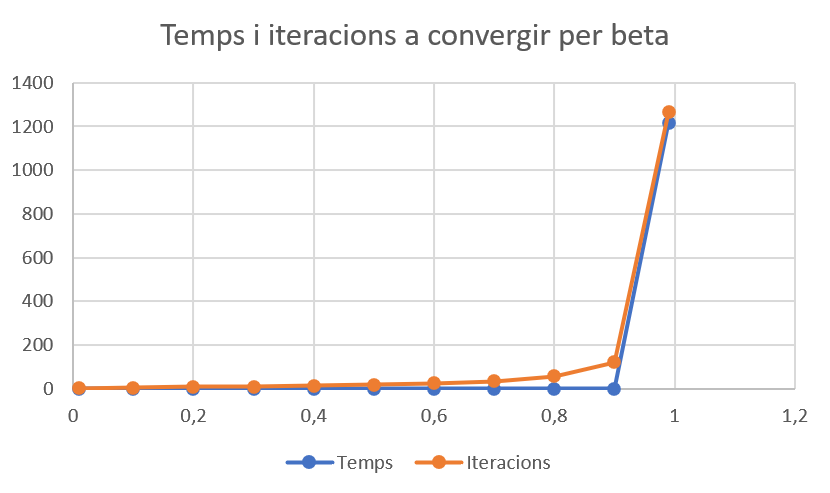

# Mineria de dades
## Practica 1 - PageRank

### Introducció
Aquesta primera pràctica de l'assignatura consisteix en la implementació de l'algorisme PageRank per a la cerca de pàgines web. 
PageRank permet ordenar les pàgines web segons la seva importància. Aquest algorisme va ser desenvolupat pels fundadors de Google per tal de indexar les pàgines web segons la seva importància.
L'algorisme veu la web com un graf dirigit, on els nodes són les pàgines web i les arestes són els enllaços entre pàgines.
Per classificar les pàgines web, PageRank assigna a cada pàgina un valor numèric, que depèn del nombre de pàgines que apunten a aquesta pàgina i de la importància d'aquestes pàgines. La suma de tots els valors de les pàgines ha de ser 1.

### Implementació
Per tal d'implementar aquesta pràctica, per una banda se'ns proporciona el fitxer gr0.California.txt, que conté el graf de totes les pàgines web que surten amb la cerca "California".
Per altre banda, se'ns proporciona el fitxer processPageRank.py, un esquelet amb el procés del PageRank on cal completar l'algorisme.
 
El programa comença parsejant els arguments d'entrada, que són el fitxer d'entrada, i com a opcional la beta a utilitzar (per defecte és 0.8).
Llavors es llegeix el fitxer d'entrada i es crea un diccionari i el graf de les pàgines web.
 
A continuació es crida el mètode de PageRank. Dins de la funció primer es calcula el out_degree, que és el nombre d'enllaços que surten de cada pàgina, que es guarda en forma d'array.
Llavors es crea una array de ranks inicials posant els ranks a 1/N, on N és el nombre de pàgines web per tal de que la suma de tots els valors sigui 1.
Seguidament s'inicialitza la diferència entre les classificacions de la iteració anterior i la actual al seu màxim per poder entrar a la iteració. Aquest valor s'anomena delta. 
I també s'inicialitza el nombre d'iteracions a 0. Aleshores, es calcula la transition_matrix, que és la probabilitat de transició d'un node a un altre, i es calcula fent la divisió matricial entre el graf i el out_degree.
 
El nombre d'iteracions és el nombre de vegades que s'actualitzaran les classificacions de les pàgines web. En aquest bucle s'iterarà sempre que delta sigui més gran a epsilon, és a dir, 
que la diferència entre les classificacions de dues iteracions consecutives sigui més gran a la constant epsilon (que per defecte és 1.0e-8). Podem dir que epsilon és la precisió de l'algorisme, i quan es quedi per sota d'aquest llindar, considerarem que la classificació ha convergit.
 
Llavors es calcula la nova classificació de les pàgines web (en la variable new_ranks), fent una multiplicació matricial entre la matriu de transició transposada i el vector (array) de les classificacions actuals. I abans de guardar-ho a new_ranks es multiplica per la probabilitat de que un usuari segueixi un enllaç de la pàgina actual, que s'anomena beta.
Aleshores es calcula el offset i se'l suma a new_ranks. Aquest offset assegura que la suma de totes les classificacions sigui 1 (afegint valor en cas que la suma sigui inferior a 1, i restant en cas que la suma sigui superior a 1).
A continuació es calcula delta fent la resta entre les classificacions actuals (ranks) i les noves classificacions (new_ranks). I es realitza el quadrat i després l'arrel quadrada per tal de que delta estigui amb valor absolut.
I abans de finalitzar la iteració, new_ranks passarà a ser la classificació actual ranks (i ranks passarà a ser new_ranks), es printa la iteració, i s'incrementa el nombre d'iteracions.
 
Quan l'algorisme ja hagi convergit, es crea el diccionari rranks on estarà la classificació final que ha quedat de les pàgines web, i es retornarà aquest diccionari junt amb el nombre d'iteracions que han fet falta per convergir.
 
Per últim, es printa el temps que ha tardat l'algorisme de PageRank en executar-se i es printa el resultat de la classificació de les pàgines web, ordenades de més a menys important.
### Resultats
Abans de passar amb els resultats, repassem el concepte de beta. Beta és la probabilitat en base 1 de passar d'una web a una altre a través d'un dels seus out-links, i per tant, 1 - beta és la probabilitat en base 1 de que un usuari segueixi un enllaç aleatori.
 
Per poder fer l'anàlisi dels resultats he provat betes de 0.01 a 0.99, amb un pas de 0.1 (0.01, 0.1, 0.2,...), i he posat en una taula les iteracions que han calgut per convergir i el temps que ha tardat en executar-se. 
Llavors he realitzat una gràfica amb aquests resultats que relaciona la beta (eix X), amb les iteracions i mil·lisegons que ha tingut l'algorisme (eix Y). La gràfica ha quedat de la següent manera:
    
Com es pot veure, a mesura que beta augmenta, el nombre d'iteracions que fa falta per convergir i el temps d'execució augmenta. Com es pot observar, la gràfica és exponencial, i per tant, té un cost O(n^2). Es pot veure que el salt de la beta 0.9 a 0.99 és molt elevat, que és on realment es nota el cost exponencial.
La forma d'aquesta gràfica i la raó per la qual quan més augmentem la beta més tarda en convergir, és perquè s'augmenta la probabilitat de que un usuari aleatori segueixi un out-link en comptes de saltar a una altre pàgina aleatòriament.
Això fa que es perdi temps i iteracions en explorar els out-links de les pàgines web, i per tant, es tarda més en convergir.
 
### Conclusions
Respecte al codi, vaig treure la creació del in-link map, ja que tardava molt en crear-se. En comptes d'utilitzar el in-link map per trobar els new_ranks, vaig canviar la implementació fent servir la matriu de transició i trobant els new_ranks a partir de la operació matricial descrita anteriorment.
Al fer la operació matricial no em cal posar més bucles, i obtinc un cost temporal molt més baix. Em va passar de tardar 9 segons en executar l'algorisme amb una beta de 0.8 (amb l'algorisme plantejat a classe), a tardar 0.06 segons amb la mateixa beta. 
 
Sense veure els resultats, es pot pensar que quan més gran és la beta més precisió pot tenir l'algorisme, ja que es centra en els out-links i no en pura aleatorietat. Però això no sempre és veritat, ja que per una banda hi haurà pàgines sense out-links que potser no es tindran en compte, i per altre banda es poden generar bucles entre enllaços que es referenciïn entre si.
I a més d'això hi ha l'augment en el cost temporal que es pot observar en els resultats.
Llavors, veient la gràfica que m'ha sortit, una beta optimitzada estaria entre el 0.8 i el 0.9. Però aquesta pot variar segons el que es vulgui prioritzar.  

### Autor
Angel García (angel.garcia)
